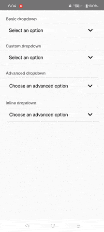

# React Native Select Picker 
`@mustapha-ghlissi/react-native-select-picker`: a Reanimated Picker Select for React Native.

[](https://choosealicense.com/licenses/mit/)
[](https://www.npmjs.com/package/@mustapha-ghlissi/react-native-select-picker)
[](https://www.npmjs.com/package/@mustapha-ghlissi/react-native-select-picker)
[](https://www.npmjs.com/package/@mustapha-ghlissi/react-native-select-picker)
[](https://www.npmjs.com/package/@mustapha-ghlissi/react-native-select-picker)
[](https://www.npmjs.com/package/@mustapha-ghlissi/react-native-select-picker)
[](https://www.npmjs.com/package/@mustapha-ghlissi/react-native-select-picker)
[](https://www.npmjs.com/package/@mustapha-ghlissi/react-native-select-picker)
[](https://www.npmjs.com/package/@mustapha-ghlissi/react-native-select-picker)

## Screenshots


## Demo


## Example
You can check out this [<u><b>Example</b></u>](./Example/).

## Installation
##### Installing the package
Use `npm` or `yarn` to install the package.

```bash
npm i @mustapha-ghlissi/react-native-select-picker
```

```bash
yarn add @mustapha-ghlissi/react-native-select-picker
```

##### Installing dependencies
```bash
npm i react-native-reanimated react-native-vector-icons
```

```bash
yarn add react-native-reanimated react-native-vector-icons
```

> Note: to finish the installation, you have to finish configuring the installed dependencies [react-native-reanimated](https://docs.swmansion.com/react-native-reanimated/docs/fundamentals/getting-started/) and [react-native-vector-icons](https://github.com/oblador/react-native-vector-icons).

## Usage
``` tsx
import Dropdown from '@mustapha-ghlissi/react-native-select-picker';
import type {DropdownItem} from '@mustapha-ghlissi/react-native-select-picker';

const items: DropdownItem[] = [
    {
        label: 'Item 1',        
        value: 1
    },
    {
        label: 'Item 2',
        value: 2
    }
];

<Dropdown items={items}/>
``` 

## Props
| Parameter | Type     | Description                |
| :-------- | :------- | :------------------------- |
| items | array<[`DropdownItem`](#dropdown-item)>: required | List of items |
| displayItems | `number`: optional | Number of items to show in the dropdown |
| placeholder | `string`: optional | Inputtext placeholder |
| styles | [`DropdownStyle`](#dropdown-style) : optional | Dropdown styles |
| icon | `string`, `ReactNode`: optional | Dropdown toggler icon |
| outlineColor | `string`: optional | Dropdown outlineColor (default = '#000') |
| borderColor | `string`: optional | Dropdown borderColor (default = '#EBEAEC') |
| borderWidth | `number`: optional | Border width used for the dropdown (default = 1) |
| inline | `boolean`: optional | Display th dropdown in inlined mode. ((default = false)) |
| multiple | `boolean`: optional | Render multi choice dropdown. ((default = false)) |
| checkIcon | `string`, `ReactNode`: optional | Display the icon when the option is checked. React native vector icons is used and `MaterialCommunityIcons` is used by default. |
| animationDuration | `number`: optional | The spending duration to toggle the dropdown. ((default = 200)) |
| onSelectChange | `callback`: required | Callback that returns the selected item/items (depending on multiple prop). |

## Types
>  ###### DropdownStyle
| Parameter | Type     | Description |
| :-------- | :------- | :------- |
| inputContainer | [`ViewStyle`](https://reactnative.dev/docs/view-style-props): optional | InputText Container style |
| inputText | [`TextStyle`](https://reactnative.dev/docs/text-style-props): optional | InputText field style |
| dropdownToggler | [`ViewStyle`](https://reactnative.dev/docs/view-style-props): optional | Dropdown Toggle style which wraps the InputText |
| iconContainer | [`ViewStyle`](https://reactnative.dev/docs/view-style-props): optional | Icon container style |
| dropdownList | [`ViewStyle`](https://reactnative.dev/docs/view-style-props): optional | Dropdown list style |
| dropdownItem | [`ViewStyle`](https://reactnative.dev/docs/view-style-props): optional | Dropdown list item style |
| dropdownItemText | [`ViewStyle`](https://reactnative.dev/docs/view-style-props): optional | Dropdown item text style |
| activeItem | [`ViewStyle`](https://reactnative.dev/docs/view-style-props): optional | Active item style |
| activeItemText | [`TextStyle`](https://reactnative.dev/docs/text-style-props): optional | Active item text style |

<br />

> ###### DropdownItem

| Parameter | Type     | Description                |
| :-------- | :------- | :------------------------- |
| label | `string`: required | Option label |
| value | `any`: required | Option value |

## Advanced Usage

``` js
import Dropdown from '@mustapha-ghlissi/react-native-select-picker';
import type {DropdownItem} from '@mustapha-ghlissi/react-native-select-picker';
import Icon from 'react-native-vector-icons/Ionicons';


const items: DropdownItem[] = [
    {
        label: 'Item 1',        
        value: 1
    },
    {
        label: 'Item 2',
        value: 2
    }
];

<Dropdown 
    items={items}
    inline
    multiple
    icon={<Icon name="chevron-down" size={26} />}
    styles={{
        inputContainer:  {
            borderColor: '#DEDEDE',
        },
        inputText: {
            fontSize: 19,
            fontFamily: 'Montserrat-Medium',
        },
        activeItem: {
            backgroundColor: 'purple',
        },
        activeItemText: {
            color: '#FFF'
        }
    }}
/>
``` 

## Donate
<p>Please contribute or donate so we can spend more time on this library.</p>

[Donate with Wise by clicking this link](https://wise.com/pay/me/mustaphag6) or by scanning the QRCode
<br />


## Authors
- [@mustapha-ghlissi](https://www.linkedin.com/in/mustapha-ghlissi)

## Other libraries
- [react-native-otp](https://github.com/mustapha-ghlissi/react-native-otp): One time password input for React Native.
- [react-native-accordion](https://github.com/mustapha-ghlissi/react-native-accordion): Reanimated collapsible sections for React Native.